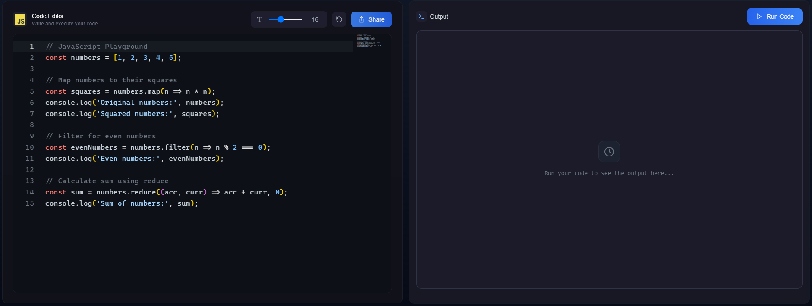
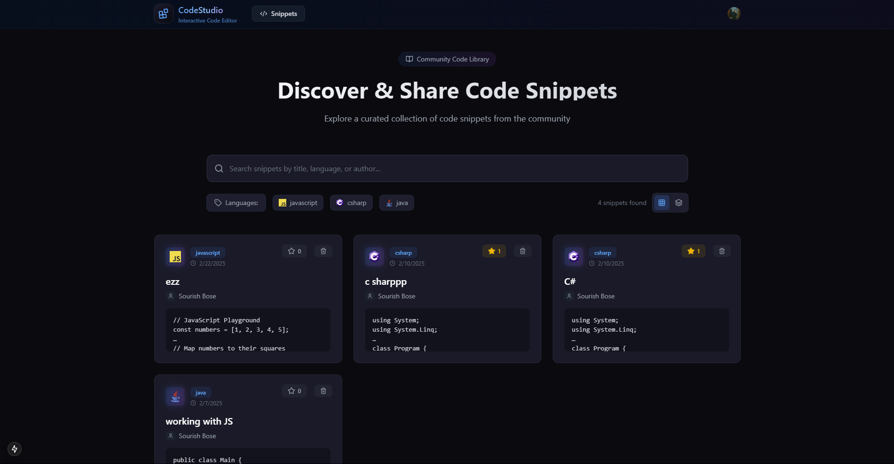
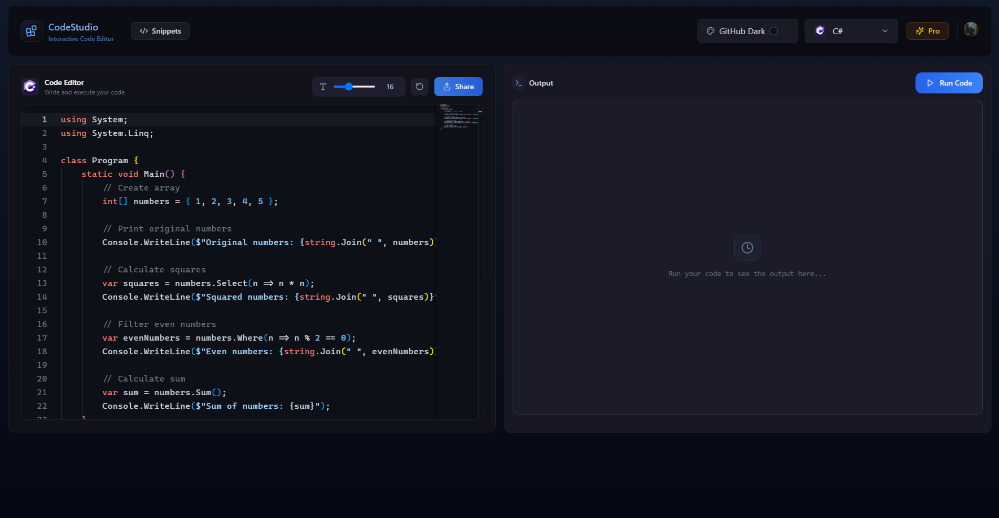
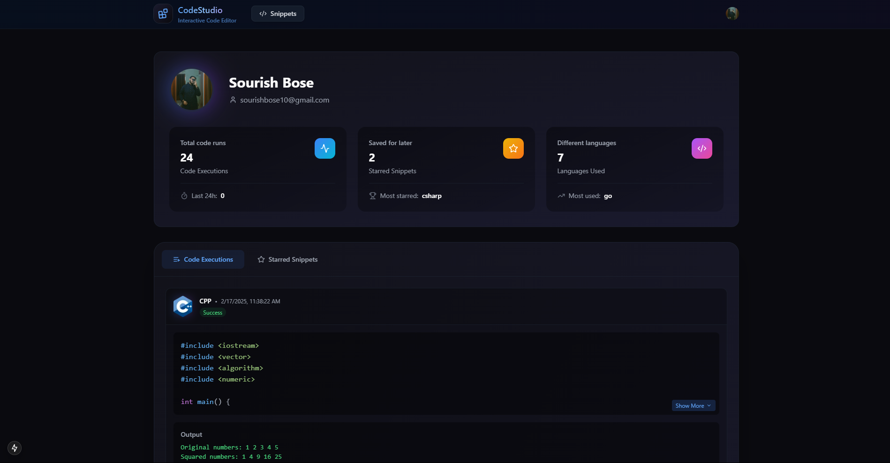

<div align="center">
  

  # ✨ Code Studio

  The elegant code editor and snippet manager for the modern developer
  
  [](https://nextjs.org)
  [](https://www.typescriptlang.org)
  [](https://tailwindcss.com)
  [](https://www.convex.dev)
</div>

## 🚀 Experience the Future of Code Editing

Code Studio combines powerful editing capabilities with elegant design to create the perfect environment for your code. Whether you're saving important snippets, sharing code with others, or managing your programming solutions, Code Studio has you covered.

<div align="center">
  
</div>

## ✨ Key Features

### 🎯 Advanced Code Editor
- **Multi-Language Support**: JavaScript, Python, Java, C++, and many more
- **Smart Syntax Highlighting**: Crystal-clear code visualization
- **Intelligent Editor**: Code suggestions that make you more productive
- **Custom Themes**: Code in style with your preferred color scheme

<div align="center">
  
</div>

### 📦 Snippet Management
- **Organize**: Create, store, and categorize your code snippets
- **Quick Access**: Find any snippet instantly
- **Privacy Controls**: Choose who sees your code
- **Version History**: Keep track of your changes

### 👥 Social Coding
- **Profile Showcase**: Display your best code snippets
- **Community Engagement**: Like and comment on shared snippets
- **Knowledge Sharing**: Learn from other developers
- **Code Discovery**: Explore snippets from the community

<div align="center">
  
</div>

## 🛠 Tech Stack

- **Frontend**: Next.js 14, TypeScript
- **Styling**: Tailwind CSS
- **Backend**: Convex
- **Authentication**: Secure user system
- **Editor**: Custom-built code editor

## 🚀 Getting Started

```bash
# Clone the repository
git clone https://github.com/yourusername/code-studio.git

# Install dependencies
pnpm install

# Set up environment variables
cp .env.example .env.local

# Start development server
pnpm dev
```

## ⚙️ Development Setup

### Prerequisites
- Node.js 18.0 or higher
- pnpm package manager
- Convex account

### Environment Variables
```
NEXT_PUBLIC_CONVEX_URL=your_convex_url
NEXT_PUBLIC_CLERK_PUBLISHABLE_KEY=your_clerk_key
CLERK_SECRET_KEY=your_clerk_secret
```

### Database Setup
```bash
pnpm dlx convex dev
```

## 🤝 Contributing

We love contributions! Here's how you can help:

1. Fork the repository
2. Create your feature branch: `git checkout -b feature/amazing-feature`
3. Commit your changes: `git commit -m 'Add amazing feature'`
4. Push to the branch: `git push origin feature/amazing-feature`
5. Submit a pull request

## 📝 License

This project is licensed under the MIT License - see the [LICENSE](LICENSE) file for details.

## 🌟 Support & Community

- 📚 Documentation: [docs.codestudio.dev](https://docs.codestudio.dev)
- 🐛 Issues: [GitHub Issues](https://github.com/yourusername/code-studio/issues)
- 💬 Discord: [Join our community](https://discord.gg/codestudio)

<div align="center">
  <br />
  <p>Made with ❤️ for developers</p>
  <p>© 2024 Code Studio. All rights reserved.</p>
</div>
