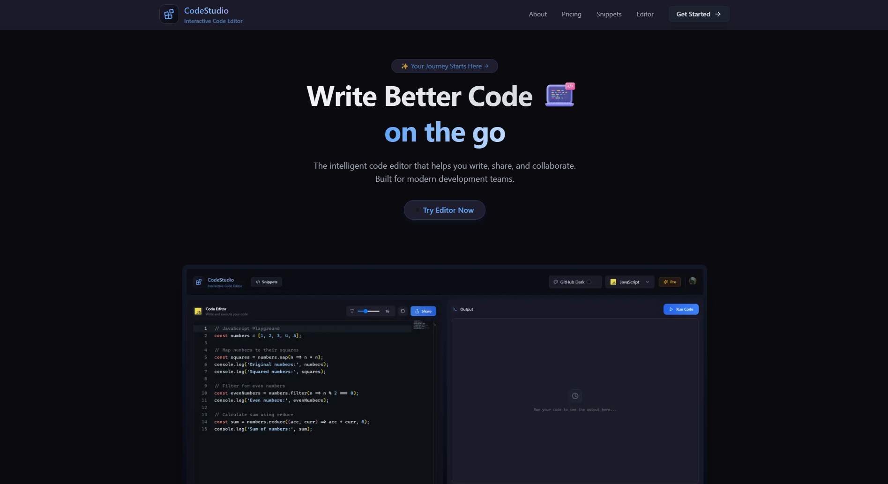
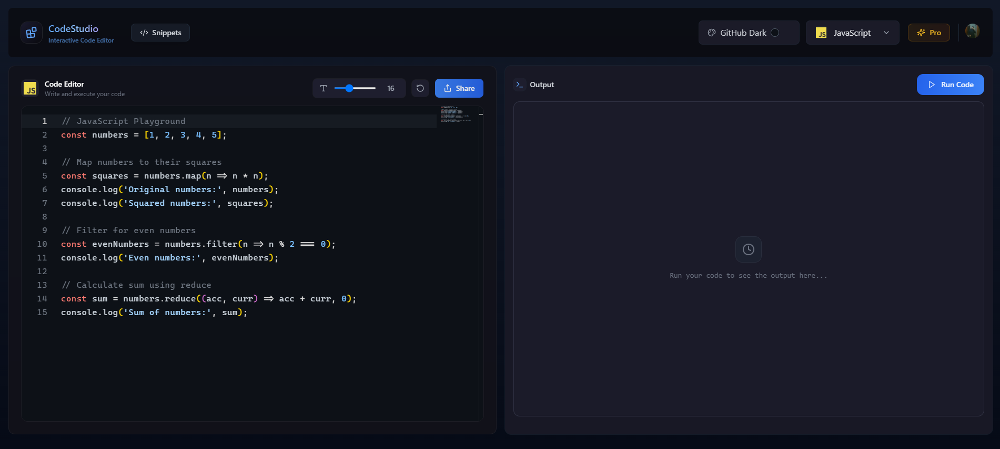
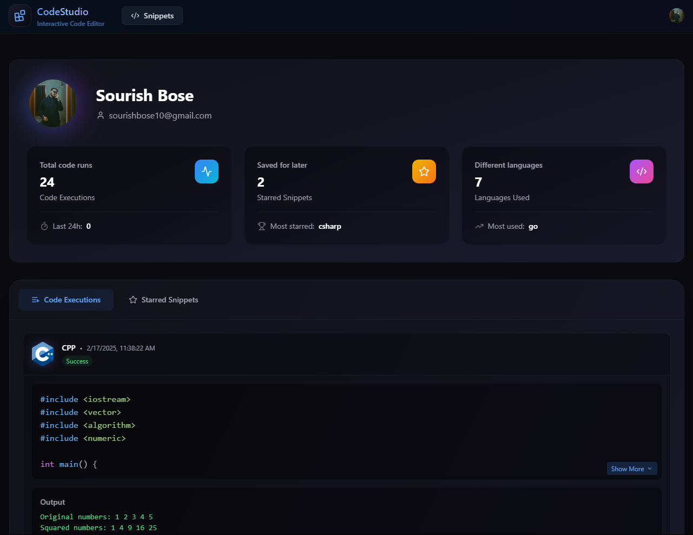

# CodeStudio

*The elegant code editor and snippet manager for the modern developer*

## 🚀 Experience the Future of Code Editing

Code Studio combines powerful editing capabilities with elegant design to create the perfect environment for your code. Whether you're saving important snippets, sharing code with others, or managing your programming solutions, Code Studio has you covered.

  

## ✨ Key Features

### 🎯 Advanced Code Editor
- **Multi-Language Support**: JavaScript, Python, Java, C++, and many more
- **Smart Syntax Highlighting**: Crystal-clear code visualization
- **Intelligent Editor**: Code suggestions that make you more productive
- **Custom Themes**: Code in style with your preferred color scheme

  

### 📦 Snippet Management
- **Organize**: Create, store, and categorize your code snippets
- **Quick Access**: Find any snippet instantly
- **Privacy Controls**: Choose who sees your code
- **Version History**: Keep track of your changes

  

### 👥 Social Coding
- **Profile Showcase**: Display your best code snippets
- **Community Engagement**: Like and comment on shared snippets
- **Knowledge Sharing**: Learn from other developers
- **Code Discovery**: Explore snippets from the community

  

## 🛠 Tech Stack

- **Frontend**: Next.js 14, TypeScript
- **Styling**: Tailwind CSS
- **Backend**: Convex
- **Authentication**: Secure user system
- **Editor**: Custom-built code editor

## 📝 License

This project is licensed under the MIT License - see the [LICENSE](LICENSE) file for details.

## 🌟 Support & Community

- 📚 Documentation: [docs.codestudio.dev](https://mycodestudio.vercel.app/Terms)
- 🐛 Issues: [GitHub Issues](www.linkedin.com/in/sourishbose10)
- 💬 Linkedin: [Reach me at](www.linkedin.com/in/sourishbose10)

   
  
Made with ❤️ for developers

  
© 2024 Code Studio. All rights reserved.

